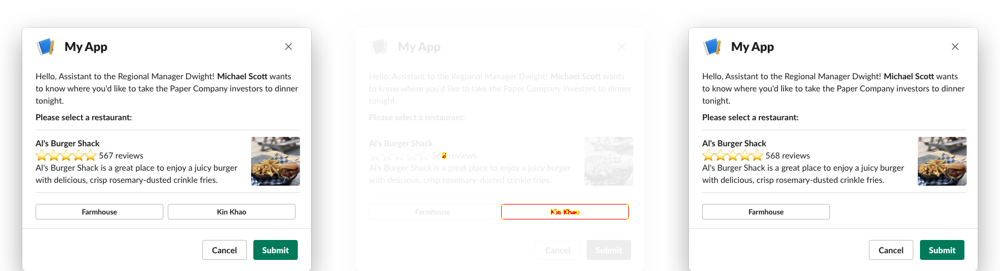

# Blocks To Images

Render Slack Block Kit json as images.

As a side effect, you are also validating the correctness of the JSON you're using, since it won't render if given invalid JSON.

This pairs amazingly with [`jest-image-snapshot`](https://github.com/americanexpress/jest-image-snapshot) for image-based snapshot testing. No more staring at long json files for hours!



Block Kit Builder is authenticated, if you use this package and want to help make this package easier to use, [Send Slack a Message](https://my.slack.com/help/requests/new) asking them to prioritize them making it unauthenticated.

## Table of Contents

- [Table of Contents](#table-of-contents)
- [Install](#install)
- [Usage](#usage)
  - [`login`](#login)
  - [`imageFromBlocks`](#imagefromblocks)
  - [Advanced Configuration](#advanced-configuration)
  - [jest globalSetup](#jest-globalsetup)

## Install

```bash
yarn add --dev @slack-wrench/blocks-to-image
# or
npm install --save-dev @slack-wrench/blocks-to-image
```

## Usage

```typescript
import BlockKitRenderer from '@slack-wrench/blocks-to-image';
import { toMatchImageSnapshot } from 'jest-image-snapshot';

// Import how you generate Slack Block kit JSON.
import MySlackBlock from './MySlackBlock';

expect.extend({ toMatchImageSnapshot });

const imageCompareOptions = { customDiffConfig: { threshold: 0.1 } };

describe('My Awesome App', () => {
  // We use the block kit builder, it can take a while
  jest.setTimeout(30000);
  let blockKitRenderer: BlockKitRenderer;

  beforeAll(async () => {
    blockKitRenderer = new BlockKitRenderer();

    // Log into a Slack Workspace that's installed block kit builder
    await blockKitRenderer.login(
      process.env.SLACK_DOMAIN || '', // eg: `community` (emit the `.slack.com)
      process.env.SLACK_EMAIL || '',
      process.env.SLACK_PASSWORD || '',
    );
  });

  afterAll(async () => {
    // Cleanup resources
    await blockKitRenderer.close();
  });

  it('Looks beautiful!', async () => {
    const blockImage = await blockKitRenderer.imageFromBlocks(MySlackBlock());

    expect(blockImage).toMatchImageSnapshot(imageCompareOptions);
  });
});
```

The function `toMatchImageSnapshot` takes in an optional configuration object `customDiffConfig` that customizes the snapshot comparison. To avoid test failures due to small differences in the image snapshot comparison, increase the threshold value that is used by jest-image-snapshot. With the default threshold value of 0.01, minor color differences in screenshots would trigger a test failure. For additional information about the configuration, visit the API documentation of [jest-image-snapshot](https://github.com/americanexpress/jest-image-snapshot#%EF%B8%8F-api).

### `login`

```typescript
blockKitRenderer.login(
    domain: string, // The domain to your slack workspace eg: `community` (emit the `.slack.com)
    email: string, // The email you use to log into the workspace above
    password: string, // The password you use for the account
) => Promise<Screenshot>
```

This package uses Slack's [Block Kit Builder](https://api.slack.com/tools/block-kit-builder) to render images. You need to log into a workspace that has Block Kit Builder installed.

### `imageFromBlocks`

```typescript
blockKitRenderer.imageFromBlocks(
    blocks: KnownBlock[], // JSON that you want to render
    mode: BlockSurfaceModes = 'message', // Surface that you want to render on ('message', 'modal', or 'appHome')
    options: ScreenshotOptions = {}, // Screenshot Options
) => Promise<Screenshot>
```

For details on additional options, see [Puppeteer docs](https://github.com/puppeteer/puppeteer/blob/v3.1.0/docs/api.md#pagescreenshotoptions)

### Advanced Configuration

`blocks-to-image` uses [Puppeteer](https://github.com/GoogleChrome/puppeteer) to generate images. If you need to pass [additional configuration](https://github.com/puppeteer/puppeteer/blob/v3.1.0/docs/api.md#puppeteerlaunchoptions) to Puppeteer, like maybe a custom chrome executable, you can do so in the constructor:

```typescript
blockKitRenderer = new BlockKitRenderer({
  puppeteer: {
    product: 'firefox',
    headless: false,
    executablePath: '/path/to/exe',
  },
});
```

#### Use an existing browser

If you're looking to connect to an existing browser instance, (for example, to [speed up jest](#jest-globalsetup)), you can do so with `connect`, passing [additional configuration](https://github.com/puppeteer/puppeteer/blob/v3.1.0/docs/api.md#puppeteerconnectoptions).

```typescript
async connect(options: ConnectOptions) => Promise<void>
```

You can do this before or after logging in depending on your use case.

### jest globalSetup

To save some time if you're running this in multiple test files with jest, you can with some additional setup use jest to login only once at the beginning of testing.

Follow [the jest instructions for custom puppeteer hookup], providing `blockKitRenderer.browser` as the `browser` in the `setup.js` and doing the login as part of the `setup` in the `puppeteer_environment.js` file. This can speed things up pretty dramatically.
