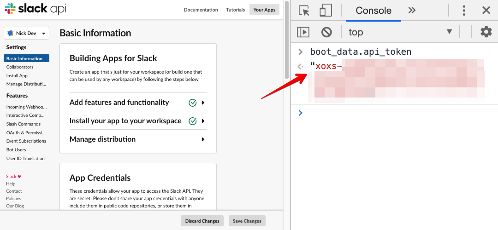

# slackctl

A utility for managing Slack [App](https://api.slack.com/start/overview) configurations as code with helpful integrations to make dev environments easy.

⚠️ Slack doesn't currently officially support this. To make this project work, we rely heavily on undocumented apis and client tokens. These tokens should be protected very carefully. Use at your own risk. This is not intended to be used for production, though it does make dev a whole lot easier.

# Table of Contents

- [Install](#install)
- [Updating a Slack App](#updating-a-slack-app)
- [App Configuration File](#app-configuration-file)
  - [Setting up a `local` config](#setting-up-a-local-config)
- [Getting a session token](#getting-a-session-token)

## Usage

With `npx`

```
npx @slack-wrench/slackctl [command] [flags]
```

Or install the package into your project as a cli.

```bash
yarn add --dev @slack-wrench/slackctl
# or
npm install --save-dev @slack-wrench/slackctl
```

⚠️ This package is incomplete and the documentation below is our to-be state rather than what's current.

Current implementation status:

- [ ] `slackctl apply`
  - [ ] ngrok proxy
  - [ ] Interactive Components
  - [ ] Slash Commands
  - [ ] OAuth permissions
  - [ ] Events subscriptions
  - [ ] Bot/App configuration
- [ ] `slackctl validate`

### Updating a Slack App

```bash
slackctl apply [flags]
```

Update an existing Slack app with a configuration. It will check the existing configuration, and apply it to match the configuration file. If you made any changes using the UI without updating the config, they will be overridden.

If your event subscription url needs changing, that url must be active and able to respond to a [`url_verification` event](https://api.slack.com/events/url_verification). If you're using the ngrok flag, then your local app should be running before trying to apply the config.

If you are using the ngrok flag, the command will wait for the specific localhost port to become active before trying to apply configuration.

You will need a [session token](#getting-a-session-token) to run this command. These tokens are not supported via Slack, use caution to keep them safe.

You can set it via the environment variable `SLACK_SESSION_TOKEN`, a [local config](#setting-up-a-local-config), or via a flag (--session-token)

**Flags:**

- `-n,--ngrok='3000'` - Start an [ngrok tunnel](https://ngrok.com/) to your localhost at a specified port. This will also modify your configuration to change the `baseUrl` to the one exposed by ngrok.
- `-t,--timeout='0'` - Used with the `--ngrok` flag, how long to wait (in seconds) for your localhost app to become active before timing out. Defaults to 0, indefinitely.

### Validating your config

```bash
slackctl validate
```

This will read your configuration and validate that it meets the correct schema.

## App Configuration File

Use this file to define your app's oauth scopes, commands, and app urls you would normally manually set in your App's [configuration page](https://api.slack.com/apps).

This file should be in the root of your project and be named one of `slack.config.yaml`, `slack.config.yml`, `slack.config.js`, or `slack.config.json`.

Example:

```yaml
# slack.config.yaml
version: v1.0

# Id of the app to apply. Can be found under `App ID` of your App Credentials
id: AS7PZ4B2N

# Base URL to resolve subscription paths
baseUrl: https://example.com

# Below are the top level section settings, these typically correspond
# to matching configuration page in the UI. If your app doesn't need one,
# you don't need to include the section
interactiveComponents:
  # Any interactions with actions, modals, or interactive components (such as buttons, select menus, and datepickers) will be sent to a URL you specify.
  requestPath: /slack/events

  # Edit message actions and their callbacks
  actions:
    # A good name is short and descriptive. Please use sentence case (e.g. File a bug, not File A Bug).
    - name: File a bug
      # A short description for your action
      description: Creates a bug report in Super App
      # Your app uses this to identify the action. It’s not visible to users.
      callbackId: action_name

  # If you want to load external data in your select menus, you need to provide an options load URL.
  optionsLoadPath: /slack/events

slashCommands:
  - command: /command
    requestPath: /slack/events
    description: Launches the Rocket!
    # Optionally list any parameters that can be passed.
    hint: '[which rocket to launch]'
    # Escape channels, users, and links sent to your app
    escape: true

# OAuth scopes let you specify exactly how your app needs to access a Slack user’s account.
oauth:
  # Scopes that access user data and act on behalf of users that authorize them.
  scopes:
    - users.profile:read
    - reactions:write

  # Scopes that govern what your app can access.
  botScopes:
    - app_mentions:read

  # Slack can limit use of your app’s OAuth tokens to a list of IP addresses and ranges you provide. Slack will then reject Web API method calls from unlisted IP addresses.
  ipRanges:
    - 123.123.123.123/7
    - 123.123.123.123

events:
  # Your app can subscribe to be notified of events in Slack (for example, when a user adds a reaction or creates a file) at a URL you choose.
  requestPath: /slack/events

  # Bot users can subscribe to events related to the channels and conversations they're part of.
  botEvents:
    - app_mention
    - message.channels
    - message.groups

  # To subscribe to an event, your app must have access to the related OAuth permission scope.
  workspaceEvents:
    - message.im

  # Your app can be notified when users post links from up to 5 domains. This requires the links:read scope and a subscription to the link_shared event.
  # You'll receive events for any subdomain, or path of the selected domains or hosts. Ports are ignored, so requests on any port will trigger an event. Using IP addresses is not allowed.
  unfurlDomains:
    - ibm.com
    - twitter.com

app:
  # Names must be shorter than 80 characters, and can’t use punctuation (other than apostrophes and periods).
  displayName: Botty McBotter
  # If this username isn’t available on any workspace that tries to install it, we will slightly change it to make it work. Usernames must be all lowercase. They cannot be longer than 21 characters and can only contain letters, numbers, periods, hyphens, and underscores.
  defaultUsername: botty
  # Show your bot's status as active, when this is false, Slack will instead automatically update your bot's status based on usage of the RTM API.
  showAsOnline: true
  # Show a home tab
  homeTab: true
  # Show a tab where direct messages your app sends will show
  messagesTab: true
```

### Setting up a `local` config

Often when developing with a team, each person will have their own test app so they can build features in isolation from each other. Because of this, it's often necessary to be able to override parts of the config.

We can also use this file to configure your environment with user-specific secrets.

**You should git ignore this file**

For this, create a second file in the project root named `slack.local.config.yaml`, `slack.local.config.yml`, `slack.local.config.js`, or `slack.local.config.json`.

When running commands, these config options will be merged into the root options taking precedence. Normally it would look something like this:

```yaml
# slack.local.config.yaml
version: v1.0

# Id of the app to apply. Can be found under `App ID` of your App Credentials
id: AS7PZ4B2N

# This token is needed to apply your app. It should be kept secret and
# will only be loaded from a local config or from the
# environment variable SLACK_SESSION_TOKEN
sessionToken: xoxs-###-###-###-###
```

## Getting a session token

1. Go to <https://api.slack.com/apps> and select your app.
2. On your app's web page, open up the developer tools console (Mac: `Cmd+Opt+J`, Windows/Linux: `Ctrl+Shift+J`)
3. Type `boot_data.api_token` and hit Enter:
   
4. The resulting value is your session token (should start with `xoxs` and look something like `xoxs-###-###-###-###`)
5. This token will expire once every 30 days, you'll need to repeat these steps to update it
